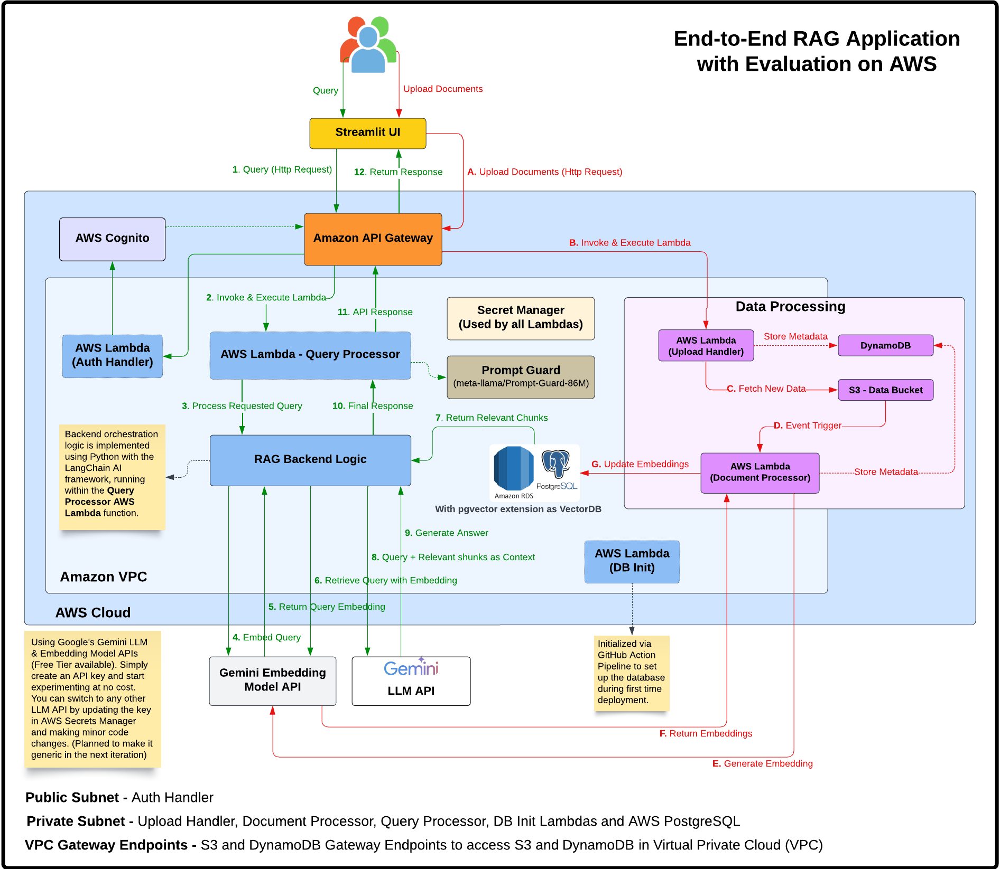
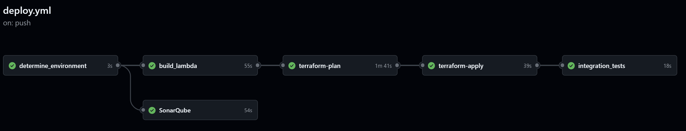

## End-to-End RAG Application with Evaluation on AWS

Terraform-based **Infrastructure as Code (IaC)** to deploy a complete AWS backend for a Retrieval-Augmented Generation (RAG) application. It integrates with Google’s free-tier Gemini Pro and Embedding models for AI powered document querying and includes a Streamlit UI with token-based authentication for interacting with the app.

👉 Related UI: [RAG UI (Streamlit Frontend)](https://github.com/Harshin1V/rag-app-on-aws/tree/main/rag_ui)  A Streamlit-based frontend application designed to interact with the backend infrastructure deployed by this project. It's located within the `rag_ui/` directory of this repository.

---

### 🔍 Overview

This repository contains the complete Terraform codebase for provisioning and managing the AWS infrastructure that powers a RAG application. It allows users to upload documents, which are then processed, embedded, and stored for efficient semantic search and AI-driven querying.

📌 Key features include:
- **IaC with Terraform**: For consistent and repeatable deployments across environments.
- **Serverless Compute**: AWS Lambda for backend logic (document processing, querying, uploads, authentication, DB initialization).
- **Vector Storage**: PostgreSQL RDS with the `pgvector` extension for storing and searching text embeddings.
- **AI Integration**: Leverages Google's Gemini Pro (for generation) and Gemini Embedding models (for text embeddings).
- **Authentication**: Secure user management with AWS Cognito.
- **CI/CD Workflows**: GitHub Actions for automated deployment, testing, and cleanup.
- **Multi-Environment Support**: Designed for `dev`, `staging`, and `production` environments.
- **Comprehensive Testing**: Includes unit and integration tests for backend Lambda functions.
- **Streamlit UI**: Includes a login page, document upload, query interface, and RAG evaluation dashboard.
---

### 🏗️ High Level Architecture



---
### 🌐 Network Flow Walkthrough (Referencing the Architecture)

#### 🗂️ Document Processing Flow with Network Components:

1. User uploads document → API Gateway → `upload_handler` Lambda
2. `upload_handler` Lambda → S3 Gateway Endpoint → S3 Bucket
3. S3 Event → `document_processor` Lambda (in private subnet)
4. `document_processor` Lambda → NAT Gateway → Internet Gateway → Gemini API (for embeddings)
5. `document_processor` Lambda → RDS Security Group → PostgreSQL Database (stores chunks/vectors)

#### 💬 Query Processing Flow with Network Components:

1. User submits query → API Gateway → `query_processor` Lambda (in private subnet)
2. `query_processor` Lambda → RDS Security Group → PostgreSQL Database (vector search)
3. `query_processor` Lambda → NAT Gateway → Internet Gateway → Gemini API (for answer generation)
4. `query_processor` Lambda → API Gateway → User (returns answer)

This network architecture ensures that sensitive operations and data are processed in a secure environment, while still allowing the necessary external communications through controlled channels.

---

### 🔁 GitHub Action Pipeline




---

### 🗂️ Repository Structure

```
.
├── .github/workflows/       # CI/CD via GitHub Actions
│   ├── deploy.yml           # Infrastructure deployment workflow
│   └── manual_cleanup.yml   # Resource cleanup workflow
├── environments/            # Environment-specific configs (dev, staging, prod)
│   └── dev/                 # Example 'dev' environment
│       ├── main.tf          # Root Terraform file for the environment
│       ├── providers.tf     # Terraform provider configurations
│       └── variables.tf     # Environment-specific variable definitions
├── modules/                 # Reusable Terraform modules
│   ├── api/                 # API Gateway configuration
│   ├── auth/                # Cognito authentication
│   ├── compute/             # Lambda functions & IAM roles
│   ├── database/            # PostgreSQL RDS with pgvector & Secrets Manager
│   ├── monitoring/          # CloudWatch Logs, Alarms & SNS Topic
│   ├── storage/             # S3 Buckets & DynamoDB Table
│   └── vpc/                 # VPC, Subnets, NAT, Security Groups, Endpoints
├── rag_ui/                  # Streamlit UI application
│   ├── app.py               # Main Streamlit application code
│   └── README.md            # README specific to the UI
├── scripts/                 # Utility shell scripts
│   ├── cleanup.sh           # Comprehensive resource cleanup script
│   ├── import_resources.sh  # Script to import existing AWS resources into Terraform state
│   └── network-diagnostics.sh # Script for troubleshooting network connectivity (e.g., Lambda to RDS)
├── src/                     # Lambda backend source code (Python)
│   ├── auth_handler/        # Lambda for Cognito authentication operations
│   ├── db_init/             # Lambda for database schema and pgvector initialization
│   ├── document_processor/  # Lambda for processing uploaded documents
│   ├── query_processor/     # Lambda for handling user queries and RAG
│   ├── tests/               # Unit and integration tests
│   │   ├── integration/     # Integration tests for deployed services
│   │   │   └── run_integration_tests.py
│   │   ├── unit/            # Unit tests for Lambda functions
│   │   │   ├── conftest.py  # Pytest common fixtures and mocks
│   │   │   ├── test_*.py    # Individual unit test files
│   │   └── __init__.py
│   ├── upload_handler/      # Lambda for handling file uploads via API
│   └── utils/               # Shared utility code (e.g., db_connectivity_test.py)
├── sonar-project.properties # SonarQube configuration file
└── tox.ini                  # tox configuration for running tests and linters
```

---
### 🧱 Infrastructure Components

The infrastructure is modularized using Terraform modules:

#### 1. **Networking (VPC - `modules/vpc`)**
-   Custom VPC with public, private, and database subnets across multiple Availability Zones.
-   Internet Gateway for public subnet access.
-   NAT Gateways (configurable for single or multiple AZs) for private subnet outbound access.
-   Route Tables for managing traffic flow.
-   Security Groups to control access to Lambdas, RDS, and Bastion hosts.
-   VPC Endpoints for S3 and DynamoDB, allowing private access from within the VPC.
-   Optional VPC Flow Logs for network traffic monitoring (enabled for `prod`).

#### 2. **Compute (Lambda Functions - `modules/compute`, `src/`)**
-   All functions are Python 3.11 based.
-   **Authentication Handler (`auth_handler`)**: Manages user authentication lifecycle with Cognito (registration, login, email verification, password reset, token refresh).
-   **Document Processor (`document_processor`)**:
    -   Triggered by S3 uploads to the `uploads/` prefix in the documents bucket.
    -   Downloads the uploaded file (PDF, TXT, CSV, etc.).
    -   Loads and chunks the document content.
    -   Generates text embeddings for chunks using the Gemini Embedding model.
    -   Stores document metadata and text chunks (with embeddings) in the PostgreSQL RDS database.
-   **Query Processor (`query_processor`)**:
    -   Handles user queries from the API.
    -   Generates an embedding for the user's query using the Gemini Embedding model.
    -   Performs a vector similarity search in PostgreSQL (using `pgvector`) against stored document chunks.
    -   Retrieves relevant chunks and prepares a context.
    -   Generates a final answer using the Gemini Pro model with the retrieved context.
    -   Optionally performs RAG evaluation (faithfulness, relevancy, context precision).
-   **Upload Handler (`upload_handler`)**:
    -   API endpoint for initiating file uploads.
    -   Receives file content (base64 encoded), name, and user ID.
    -   Uploads the raw file to a specific S3 path (`uploads/{user_id}/{document_id}/{file_name}`).
    -   Stores initial document metadata in PostgreSQL and DynamoDB.
-   **DB Initialization (`db_init`)**:
    -   A Lambda function invoked during CI/CD deployment.
    -   Connects to the PostgreSQL RDS instance.
    -   Creates necessary database tables (`documents`, `chunks`) if they don't exist.
    -   Enables the `pgvector` extension required for vector operations.
-   **IAM Roles & Policies**: Granular permissions for Lambda functions to access S3, DynamoDB, RDS (via Secrets Manager), Secrets Manager, and CloudWatch Logs.

#### 3. **Storage (`modules/storage`, `modules/database`, `environments/dev/main.tf`)**
-   **S3 Buckets**:
    -   `{project_name}-{stage}-documents`: Stores uploaded documents. S3 event notifications trigger the `document_processor` Lambda. Configured with CORS and lifecycle rules.
    -   `{project_name}-{stage}-lambda-code`: Stores Lambda function deployment packages (ZIP files).
    -   `{project_name}-terraform-state`: Central S3 bucket for storing Terraform state files (versioning enabled).
-   **DynamoDB**:
    -   `{project_name}-{stage}-metadata`: Stores metadata related to documents (e.g., status, S3 key, user ID). Used by `upload_handler` and `document_processor`. Features Global Secondary Indexes (GSIs) on `user_id` and `document_id`, and Point-in-Time Recovery (PITR).
    -   `{project_name}-{stage}-terraform-state-lock`: DynamoDB table for Terraform state locking, ensuring safe concurrent operations.
-   **PostgreSQL RDS with `pgvector` (`modules/database`)**:
    -   Managed PostgreSQL database instance.
    -   Utilizes the `pgvector` extension for efficient storage and similarity search of text embeddings.
    -   Stores structured document information in a `documents` table and text chunks with their corresponding vector embeddings in a `chunks` table.
    -   Database credentials are securely managed by AWS Secrets Manager.
 
#### 4. **API & Authentication (`modules/api`, `modules/auth`)**
-   **API Gateway (REST API)**:
    -   Provides public HTTP(S) endpoints for backend Lambda functions.
    -   Routes include `/upload`, `/query`, and `/auth`.
    -   Configured with CORS for frontend integration.
    -   Amazon API Gateway has a default timeout of 30 seconds. However, GenAI use cases may require longer processing times. To        support this, we’ve configured the timeout to 150,000 milliseconds (2.5 minutes). Selecting United States (N. Virginia) as the region since it's set as the default in terraform.tfvars.

-   **Cognito User Pools**:
    -   Manages user identities, including registration, sign-in, email verification, and password reset functionalities.
    -   Defines password policies and user attributes.
    -   Issues JWT (JSON Web Tokens) upon successful authentication.
    -   Includes an App Client configured for the frontend application.
-   **JWT-based API Authorization**:
    -   API Gateway utilizes a Cognito JWT authorizer to protect the `/upload` and `/query` endpoints, ensuring only authenticated users can access them.
    -   The `/auth` endpoint is public to allow user registration and login.
-   **Secrets Management (`modules/compute`, `modules/database`)**:
    -   **AWS Secrets Manager**: Used to securely store and manage sensitive information:
        -   `{project_name}-{stage}-gemini-api-key`: Stores the Google Gemini API Key used by `document_processor` and `query_processor`.
        -   `{project_name}-{stage}-db-credentials`: Stores the master credentials for the PostgreSQL RDS instance, automatically rotated or managed by Terraform.

#### 5. **Monitoring & Alerts (`modules/monitoring`)**
-   **CloudWatch Logs**: Centralized logging for API Gateway requests and all Lambda function executions. Log groups are configured with retention policies.
-   **CloudWatch Alarms**: Monitors key metrics for Lambda functions (e.g., `Errors` for `document_processor`, `query_processor`).
-   **SNS Topic (`{project_name}-{stage}-alerts`)**:
    -   Acts as a notification channel.
    -   CloudWatch Alarms publish messages to this topic when an alarm state is reached.
    -   Can be configured with subscriptions (e.g., email) to notify administrators of issues.

---

## ⚙️ Build and Deployment

### 🛠️ Prerequisites

-   ✅ **Python**: `3.11+` (For Streamlit UI).
-   ✅ **AWS Cloud Account**
-   ✅ **GitHub Account**
-   ✅ **Git installed on Local Machine**
-   ✅ **Google API Key**
-   ✅ **SonarCloud Account for Code Quality Checks**
    
---
### 🌍 Environment Management

The repository supports multiple deployment environments, typically:
*   `dev`: For development and testing.
*   `staging`: For pre-production validation.
*   `prod`: For the live production environment.

Configuration for each environment (Terraform variables, backend configuration) is managed within its respective subfolder under the `environments/` directory (e.g., `environments/dev/`, `environments/staging/`).

---
### 🚀 Build and Deployment

#### 🔐 Set Up GitHub Repo for Build & Deployment

1. Fork the Repository
   
   👉 https://github.com/Harshin1V/rag-app

2. Clone to Your Local Machine:

    ```
    git clone https://github.com/<your-github-username>/rag-app-on-aws.git
    ```
3. Customize Project Configuration:

   Update the following fields in environments/<stage>/terraform.tfvars:

   * `project_name = "<your-project-name>"` – to avoid global resource name conflicts (S3 buckets).
   * `github_repo = "<your-github-username>/rag-app"` – for CI/CD pipeline setup.
   * `alert_email = "<your-email>"` – for receiving deployment alerts.


#### 🔐 Setting Up GitHub Secrets

1.  **AWS Access Keys**
2.  **SonarQube Token**
3.  **Google API Key**

#### 🤖 Automated Deployment via GitHub Actions

The repository includes two primary GitHub Actions workflows:

1.  **Terraform AWS Deployment (`.github/workflows/deploy.yml`)**:
    *   Deploys the infrastructure based on the target environment.
    *   Triggered automatically on pushes to `develop` (for `dev` env), `main` (for `prod` env), and `staging` (for `staging` env).
    *   Can also be manually triggered from the GitHub Actions tab, allowing selection of environment and other parameters like `reset_db_password` or `bastion_allowed_cidr` (Keep everything default if running pipeline manually)
2.  **Manual AWS Cleanup (`.github/workflows/manual_cleanup.yml`)**:
    *   A manually triggered workflow to tear down all AWS resources for a specified environment.
    *   Uses the `scripts/cleanup.sh` script.

---

### 🔄 Running Streamlit UI

👉 UI Readme: https://github.com/Harshin1V/rag-app/rag_ui

  ```bash
  cd rag-app/rag_ui
  python -m venv venv
  source venv/bin/activate
  pip install -r requirements.txt
  ```

*  Usage

    ```bash
    streamlit run app.py
    ```

    Visit `http://localhost:8501`, register or log in, upload documents, and start querying.

---

### 🔄 CI/CD Pipeline Highlights (`deploy.yml`)

The `deploy.yml` workflow automates the deployment process with the following key steps:

1.  **Determine Environment**: Identifies the target environment (`dev`, `staging`, `prod`) based on the Git branch or manual workflow input.
2.  **Code Quality (SonarQube)**: If a `SONAR_TOKEN` secret is configured, it runs SonarQube analysis using `tox` for code quality checks.
3.  **Build Lambda Functions**:
    *   Sets up Python 3.11.
    *   Installs dependencies for each Lambda function.
    *   Packages the `auth_handler`, `db_init`, `document_processor`, `query_processor`, and `upload_handler` Lambda functions into ZIP artifacts.
    *   Uploads these artifacts to GitHub Actions.
4.  **Terraform Setup & Plan**:
    *   Configures AWS credentials using GitHub secrets.
    *   Dynamically creates `backend.tf` for S3 state storage.
    *   Creates the Terraform state S3 bucket (`{PROJECT_NAME}-terraform-state`) and DynamoDB lock table (`{PROJECT_NAME}-{STAGE}-terraform-state-lock`) if they don't already exist.
    *   Downloads Lambda artifacts and uploads them to the `{PROJECT_NAME}-{STAGE}-lambda-code` S3 bucket.
    *   Initializes Terraform (`terraform init`).
    *   Attempts to import existing AWS resources into the Terraform state using `scripts/import_resources.sh` (this helps adopt unmanaged resources).
    *   Generates a Terraform plan (`terraform plan`) using environment-specific variables (e.g., `reset_db_password`, `enable_lifecycle_rules`, `bastion_allowed_cidr`).
    *   Uploads the `tfplan` file as a GitHub artifact.
5.  **Terraform Apply** (Conditional - runs on push to specific branches or manual trigger):
    *   Downloads the `tfplan` artifact.
    *   Applies the Terraform configuration (`terraform apply -auto-approve tfplan`).
    *   Extracts outputs like `api_endpoint` and `cognito_app_client_id`.
    *   Uploads an `env_vars.env` file with these outputs for UI configuration.
6.  **Database Availability & Initialization**:
    *   (Optional via `wait_for_db` input) Waits for the RDS instance to become available.
    *   If `reset_db_password` was true, updates Lambda environment variables with the new DB secret ARN.
    *   Ensures `db_init` and `auth_handler` Lambda functions are updated with the latest code from S3 (as a safeguard).
    *   Invokes the `db_init` Lambda function to set up the PostgreSQL schema and `pgvector` extension. This step includes retries in case the database isn't immediately ready.
7.  **Verify Deployment**: Makes a health check call to the `upload_handler` Lambda via API Gateway.
8.  **Integration Tests**:
    *   Sets up Python and installs dependencies.
    *   Runs integration tests located in `src/tests/integration/run_integration_tests.py` against the deployed API Gateway endpoint.
    *   Uploads test results as a GitHub artifact.

---


### 🧰 Utilities

The `/scripts/` folder contains helpful shell scripts:

-   **`cleanup.sh`**: A comprehensive script to tear down all AWS resources created by Terraform for a specific environment. It requires `jq` to be installed. **Use with extreme caution as this is destructive.**
-   **`import_resources.sh`**: Aids in importing existing AWS resources into the Terraform state. This can be useful if some resources were created manually or outside of Terraform initially.
-   **`network-diagnostics.sh`**: A script to help troubleshoot network connectivity issues, particularly between Lambda functions and the RDS database within the VPC. It checks security groups, RDS status, and can test DNS resolution from a Lambda.

---

### 🧹 Uninstallation

To remove all AWS resources created by this project for a specific environment:

#### Using GitHub Actions (Recommended):
1.  Navigate to your repository's "Actions" tab on GitHub.
2.  Find the "Manual AWS Cleanup" workflow in the sidebar.
3.  Click "Run workflow".
4.  Select the branch (usually your main or develop branch).
5.  Enter the **environment name** (e.g., `dev`, `staging`, `prod`) you wish to clean up.
6.  Click "Run workflow". This will execute the `scripts/cleanup.sh` script with the necessary context.

