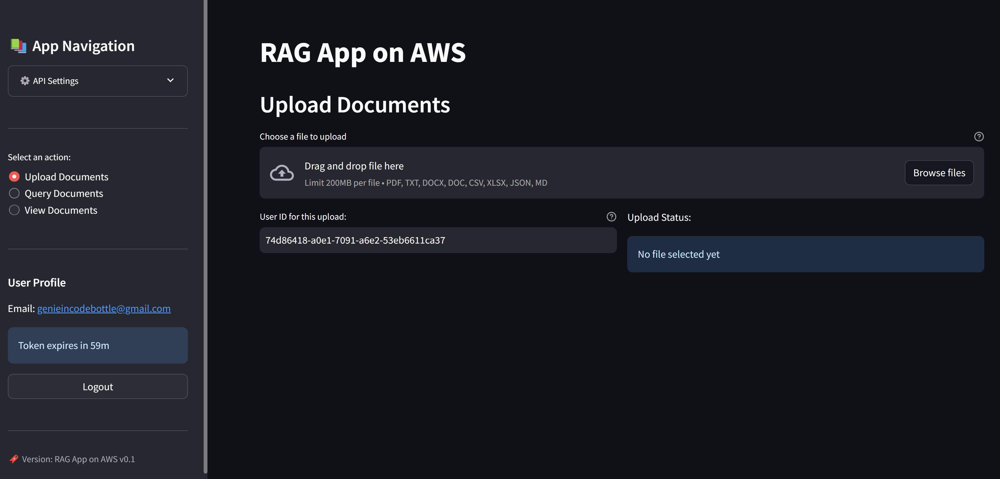

## Hybrid RAG App: Local Streamlit UI with AWS Cloud Backend 

A Streamlit based web app for Retrieval Augmented Generation (RAG) powered by AWS services.




### 🧩 Overview

A web interface to upload documents, query them using natural language, and retrieve AI-generated responses via an AWS-powered RAG backend using Google's free-tier Gemini Pro and Embedding models.

### ✨ Features

- Secure Cognito-based user authentication with auto token refresh
- Upload, view, and manage various document types
- AI-powered querying with relevance scoring and history
- Clean, intuitive Streamlit UI


### 🏗️ System Architecture

- **Frontend**: Streamlit UI
- **Backend**: AWS API Gateway, Lambda, Cognito, S3

### ⚙️ Prerequisites

- Python 3.8+
- Streamlit 1.45.0+
- AWS account with backend APIs deployed

### 🚀 Installation

```bash
git clone https://github.com/Harshin1V/rag-app.git
cd rag-app-on-aws/rag_ui
python -m venv venv
pip install -r requirements.txt
```

### 💡 Usage

```bash
streamlit run app.py
```

Visit `http://localhost:8501`, register or log in, upload documents, and start querying.

### 🔌 API Endpoints

- `/auth`: Register, login, refresh token, password reset
- `/upload`: Upload and track documents
- `/query`: Ask natural language questions, get AI responses

### 🔐 Authentication

Uses Cognito with JWTs, email verification, and password reset.

### 📄 Document Management

Uploaded docs are:
- Converted and chunked
- Embedded into vectors
- Indexed for semantic retrieval
